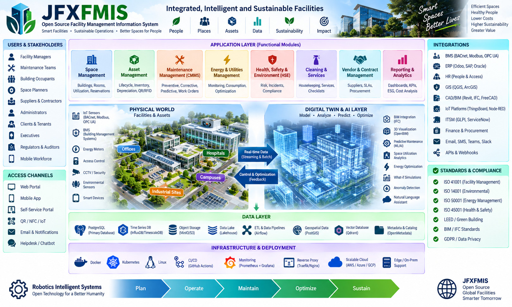
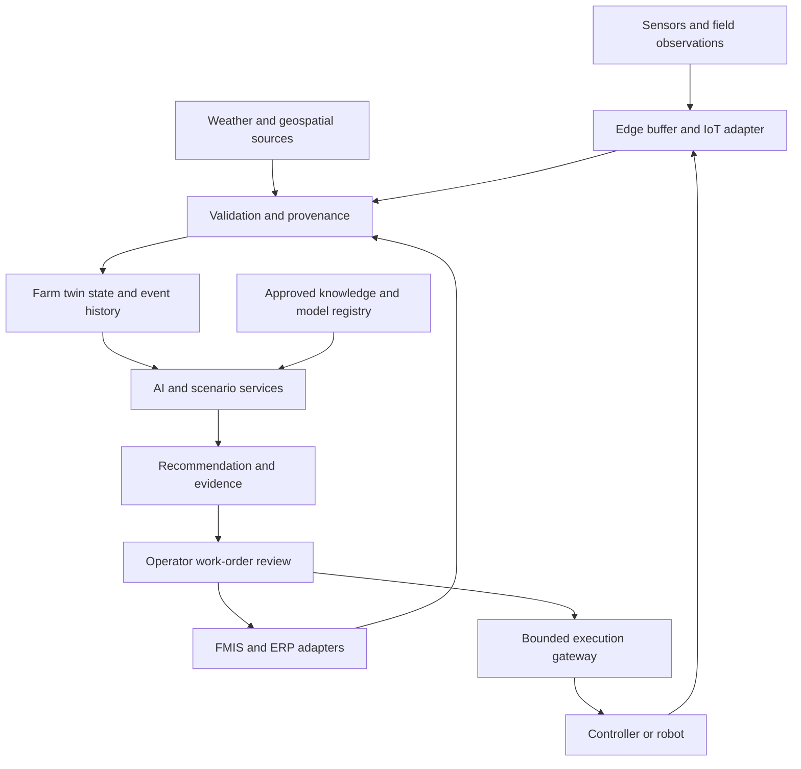

<p align="center">
  
</p>

<p align="center">
  <em>
    Open-source architecture for AI-powered farm management, precision agriculture,
    IoT, GIS, robotics, digital twins, analytics and sustainable agricultural operations.
  </em>
</p>


## OpenTwin Agentic AI Farm Management Information System

> An open, modular reference architecture for AI-assisted farm
> management, agricultural digital twins, IoT/edge sensing, geospatial
> intelligence, simulation, automation, robotics, vertical farming,
> aquaculture, livestock, renewable energy, and traceable agri-food
> operations.

## Table of Contents

-   [Description and Context](#description-and-context)
-   [Vision](#vision)
-   [Objectives](#objectives)
-   [Reference Architecture](#reference-architecture)
-   [Core Domains](#core-domains)
-   [Digital Twin Architecture](#digital-twin-architecture)
-   [AI and Decision Intelligence](#ai-and-decision-intelligence)
-   [IoT and Edge](#iot-and-edge)
-   [Geospatial Intelligence](#geospatial-intelligence)
-   [Vertical and Floating Farming](#vertical-and-floating-farming)
-   [Aquaculture](#aquaculture)
-   [Livestock and Grazing](#livestock-and-grazing)
-   [Farm Robotics and Automation](#farm-robotics-and-automation)
-   [Energy Water and Circular
    Resources](#energy-water-and-circular-resources)
-   [Supply Chain and Traceability](#supply-chain-and-traceability)
-   [MBSE and Simulation](#mbse-and-simulation)
-   [Open Modular Interfaces](#open-modular-interfaces)
-   [Data Architecture](#data-architecture)
-   [Security Privacy and Governance](#security-privacy-and-governance)
-   [Technology Compendium](#technology-compendium)
-   [Compendium Integration Architecture](#compendium-integration-architecture)
-   [Open AI and Simulation Workflows](#open-ai-and-simulation-workflows)
-   [Integration Profiles and Delivery Gates](#integration-profiles-and-delivery-gates)
-   [User Guide](#user-guide)
-   [Installation Guide](#installation-guide)
-   [Dependencies](#dependencies)
-   [Recommended Repository
    Structure](#recommended-repository-structure)
-   [MVP](#mvp)
-   [Development Roadmap](#development-roadmap)
-   [How to Contribute](#how-to-contribute)
-   [Code of Conduct](#code-of-conduct)
-   [Authors and Maintainers](#authors-and-maintainers)
-   [Additional Information](#additional-information)
-   [Intellectual Property and Open
    Design](#intellectual-property-and-open-design)
-   [Disclaimer](#disclaimer)
-   [License](#license)

------------------------------------------------------------------------

## Description and Context

**jfxfmis / OpenTwin AI Farm Management Information System**
consolidates a broad agricultural software and engineering compendium
into an interoperable reference architecture for modern farm operations.

The project is intended to connect:

``` text
Farm Assets
    |
Sensors / IoT / Weather / GIS / Machines
    |
OpenTwin Digital Twin Layer
    |
Farm Management + ERP + Knowledge
    |
AI / ML / Simulation / Optimization
    |
Decision Support + Automation
    |
Robotics / Irrigation / Energy / Logistics
    |
Traceability + Sustainability + Outcomes
```

The architecture is designed for conventional farms, precision
agriculture, agroindustry, greenhouses, vertical farms, floating farms,
aquaculture, livestock operations, research farms, and
community-oriented food systems.

The repository should be treated as a **reference architecture,
integration compendium, and experimental engineering platform**.
Technologies listed in the compendium are not automatically mandatory
runtime dependencies.

------------------------------------------------------------------------

## Vision

OpenTwin FMIS aims to provide an open agricultural digital backbone in
which physical assets, operational records, environmental measurements,
models, AI services, and automation can be integrated without making the
farm dependent on a single vendor.

``` text
                    OPENTWIN FMIS

        Physical Farm          Digital Farm
             |                      |
   Crops / Animals / Water     Digital Twins
   Machines / Buildings       Models / History
             |                      |
             +----------+-----------+
                        |
                Farm Data Platform
                        |
       +----------------+----------------+
       |                |                |
      AI/ML         Simulation       Management
       |                |                |
 Forecasting       What-if Models    Planning / ERP
 Vision            Modelica          Inventory
 Optimization      MBSE              Finance
       |                |                |
       +----------------+----------------+
                        |
                Decision & Control
                        |
         Human Operators + Automation
```

### Design Principles

-   Open source where practical.
-   Open standards and documented interfaces.
-   Replaceable modules.
-   Human-centered decision support.
-   Traceable AI and model outputs.
-   Local-first and edge-capable operation.
-   Cloud-native scalability where required.
-   Reproducible simulation and analytics.
-   Interoperability with existing FMIS and ERP systems.
-   Sustainable use of energy, water, land, and marine resources.
-   No intentional vendor lock-in.
-   Original and sufficiently abstract reference designs.

------------------------------------------------------------------------

## Objectives

-   Create a modular FMIS architecture.
-   Integrate agricultural digital twins with operational farm data.
-   Connect IoT, weather, soil, water, crop, livestock, machinery, and
    geospatial data.
-   Enable AI-assisted forecasting and decision support.
-   Support precision agriculture and controlled-environment
    agriculture.
-   Support vertical and floating farming.
-   Support recirculating aquaculture systems.
-   Integrate farm robotics and autonomous equipment.
-   Connect agricultural operations with ERP and warehouse management.
-   Enable renewable-energy and resource optimization.
-   Preserve traceability from observations to decisions and outcomes.
-   Support MBSE using Arcadia/Capella.
-   Support Modelica and other simulation environments.
-   Provide open APIs for external applications.
-   Separate mandatory components from optional integrations and
    research references.

------------------------------------------------------------------------

## Reference Architecture

``` text
┌───────────────────────────────────────────────────────────┐
│                    EXPERIENCE LAYER                       │
│ Web UI | Mobile | Dashboards | GIS | CLI | External Apps │
└──────────────────────────┬────────────────────────────────┘
                           │
┌──────────────────────────▼────────────────────────────────┐
│                 FARM MANAGEMENT LAYER                     │
│ Farm | Field | Crop | Livestock | Aquaculture | Inventory│
│ Work Orders | Finance | Warehouse | Supply Chain         │
└──────────────────────────┬────────────────────────────────┘
                           │
┌──────────────────────────▼────────────────────────────────┐
│                  OPENTWIN CORE                            │
│ Asset Registry | Twin Registry | State | Events | Models │
│ Relationships | Provenance | Rules | Workflow            │
└──────────────────────────┬────────────────────────────────┘
                           │
┌──────────────────────────▼────────────────────────────────┐
│              INTELLIGENCE & SIMULATION                    │
│ AI/ML | RAG | Forecasting | Optimization | Modelica      │
│ GIS Analytics | Computer Vision | What-if Simulation     │
└──────────────────────────┬────────────────────────────────┘
                           │
┌──────────────────────────▼────────────────────────────────┐
│                   DATA & EVENTS                           │
│ SQL | Time Series | Object | Vector | Geospatial | Queue │
└──────────────────────────┬────────────────────────────────┘
                           │
┌──────────────────────────▼────────────────────────────────┐
│                    EDGE / OT LAYER                        │
│ IoT | Weather | PLC | Robots | Irrigation | Cameras      │
│ Energy | Water | Aquaculture | Machinery | Gateways      │
└───────────────────────────────────────────────────────────┘
```

Cross-cutting concerns:

**Security · Privacy · Identity · Audit · Observability · Data Quality ·
Licensing · Sustainability · Safety · Versioning**

------------------------------------------------------------------------

## Core Domains

### Farm and Organization

Canonical entities can include:

``` text
Organization
 └─ Farm
     ├─ Site
     ├─ Field / Plot
     ├─ Greenhouse
     ├─ Vertical Farm
     ├─ Floating Farm
     ├─ Aquaculture Unit
     ├─ Livestock Unit
     ├─ Warehouse
     ├─ Energy System
     └─ Equipment
```

### Production

``` text
Season
 └─ Production Plan
     ├─ Crop Cycle
     ├─ Livestock Cycle
     ├─ Aquaculture Cycle
     ├─ Tasks
     ├─ Inputs
     ├─ Observations
     ├─ Harvest
     └─ Outcomes
```

### Operational Records

The platform can record:

-   planting and crop cycles;
-   soil observations;
-   irrigation;
-   fertilizer and nutrient applications;
-   pests and diseases;
-   weather;
-   animal groups and grazing;
-   aquaculture water conditions;
-   machinery activity;
-   labor and work orders;
-   inventory;
-   warehouse movements;
-   energy consumption and production;
-   harvests;
-   quality records;
-   distribution and traceability events.

------------------------------------------------------------------------

## Digital Twin Architecture

The digital twin is a synchronized digital representation of farm assets
and processes.

``` text
Physical Asset
     |
Sensors / Observations / Events
     |
Twin Adapter
     |
Digital Twin State
     |
+----+-------------------+
|                        |
Models                 History
|                        |
Simulation             Analytics
|                        |
+------------+-----------+
             |
      Decision Support
             |
 Human Approval / Automation
```

### Twin Types

-   farm twin;
-   field twin;
-   crop twin;
-   greenhouse twin;
-   vertical-farm twin;
-   floating-farm twin;
-   aquaculture twin;
-   livestock twin;
-   irrigation twin;
-   energy twin;
-   warehouse twin;
-   robot/machine twin;
-   environmental twin.

### Example Twin Schema

``` yaml
twin:
  id:
  type:
  physical_asset_id:
  location:
  geometry:
  state:
  telemetry_refs: []
  model_refs: []
  relationships: []
  control_capabilities: []
  provenance: {}
  updated_at:
```

------------------------------------------------------------------------

## AI and Decision Intelligence

AI should augment rather than obscure farm decision-making.

### Candidate Capabilities

-   crop forecasting;
-   yield estimation;
-   irrigation recommendations;
-   disease-risk estimation;
-   anomaly detection;
-   computer vision;
-   geospatial crop analysis;
-   weather-aware planning;
-   nutrient optimization;
-   livestock monitoring;
-   aquaculture monitoring;
-   predictive maintenance;
-   energy optimization;
-   logistics optimization;
-   knowledge retrieval;
-   natural-language farm assistants.

### AI Governance

``` text
Observation
    |
AI Model
    |
Recommendation
    |
Evidence / Confidence / Provenance
    |
Human Review or Bounded Automation
    |
Action
    |
Measured Outcome
```

For consequential actions, the system should retain model version, input
references, timestamps, confidence where meaningful, decision authority,
and resulting action.

------------------------------------------------------------------------

## IoT and Edge

``` text
Sensors / Machines
       |
Field Gateway
       |
Local Rules / Buffer
       |
MQTT / HTTP / Events
       |
Farm Data Platform
       |
Digital Twin
```

Typical devices:

-   soil moisture;
-   temperature and humidity;
-   weather stations;
-   water-quality probes;
-   cameras;
-   irrigation controllers;
-   tank sensors;
-   energy meters;
-   livestock tags;
-   machinery telemetry;
-   greenhouse controllers;
-   autonomous robots.

Edge operation is useful where connectivity is intermittent or
latency-sensitive.

------------------------------------------------------------------------

## Geospatial Intelligence

Geospatial data can connect farm boundaries, fields, terrain, weather,
imagery, vegetation indexes, crop observations, and machine activity.

``` text
Satellite / Drone / GIS / Weather
              |
       Geospatial Pipeline
              |
       Feature Extraction
              |
          AI / ML
              |
      Field Digital Twin
              |
      Decision Support
```

The original project compendium references **FarmVibes.AI** as a
multimodal geospatial ML resource for agriculture and **AgML** as an
agricultural machine-learning framework.

------------------------------------------------------------------------

## Vertical and Floating Farming

OpenTwin extends FMIS concepts to controlled-environment and floating
agricultural facilities.

``` text
              Floating / Vertical Farm
                        |
        +---------------+---------------+
        |               |               |
   Crop Systems      Utilities       Logistics
        |               |               |
 Hydroponics        Water Loop       Inventory
 Aeroponics         Energy           Cold Chain
 Climate            Nutrients        Distribution
 Lighting           HVAC             Traceability
        |               |               |
        +---------------+---------------+
                        |
                  Digital Twin
```

### Candidate Capabilities

-   hydroponics;
-   aeroponics;
-   environmental control;
-   LED-lighting management;
-   nutrient management;
-   water recirculation;
-   desalination integration where appropriate;
-   renewable energy;
-   AI crop management;
-   automated harvesting;
-   local distribution;
-   environmental monitoring.

Floating facilities should additionally model buoyancy-related
infrastructure, mooring interfaces, marine environmental conditions,
logistics access, corrosion/maintenance considerations, and local
regulatory requirements.

------------------------------------------------------------------------

## Aquaculture

The source compendium includes a **Modelica library for simulation of
recirculating aquaculture systems**.

OpenTwin can represent:

``` text
Water Source
   |
Treatment
   |
Fish Tank / Production Unit
   |
Water Quality Sensors
   |
Recirculation / Filtration
   |
Digital Twin
   |
Simulation + AI
   |
Operator Decision
```

Typical variables:

-   temperature;
-   dissolved oxygen;
-   pH;
-   salinity;
-   flow;
-   nutrient concentrations;
-   biomass estimates;
-   feed;
-   energy;
-   water consumption.

------------------------------------------------------------------------

## Livestock and Grazing

The architecture can integrate grazing planning and livestock
management.

Potential functions include:

-   paddock mapping;
-   herd/group records;
-   seasonal grazing plans;
-   water availability;
-   pasture observations;
-   movement records;
-   health/event records;
-   feed planning;
-   geospatial analysis;
-   environmental indicators.

The original repository references **Grazing Manager** as a map-based
seasonal planning resource.

------------------------------------------------------------------------

## Farm Robotics and Automation

The original compendium references FarmBot and autonomous warehouse
robotics.

``` text
FMIS / Digital Twin
        |
 Mission / Work Order
        |
 Automation Gateway
        |
 Robot / Machine / Controller
        |
 Telemetry + Result
        |
 Twin State Update
```

Potential automation:

-   seeding;
-   irrigation;
-   inspection;
-   crop imaging;
-   harvesting assistance;
-   warehouse transport;
-   inventory movement;
-   greenhouse operations;
-   autonomous scouting.

Safety-critical machine control must remain isolated from untrusted AI
services and should use appropriate engineering safeguards.

------------------------------------------------------------------------

## Energy Water and Circular Resources

### Renewable Energy

``` text
Solar + Wind + Grid
        |
 Energy Management
        |
 Storage / Loads
        |
 Farm Operations
```

### Water

``` text
Source → Treatment → Storage → Irrigation / Aquaculture
                         |
                    Recirculation
                         |
                    Monitoring
```

### Circular Resource Model

Possible flows:

-   nutrient recovery;
-   water reuse;
-   organic-residue management;
-   composting;
-   energy recovery;
-   aquaponic coupling;
-   optimized fertilizer use.

The goal is to measure flows before claiming sustainability benefits.

------------------------------------------------------------------------

## Supply Chain and Traceability

``` text
Input
  |
Production
  |
Harvest
  |
Processing
  |
Storage
  |
Transport
  |
Distribution
  |
Consumer / Buyer
```

Traceability records may connect lots, timestamps, locations,
transformations, quality results, certifications, custody events, and
provenance.

Blockchain is optional; traceability should not depend on blockchain
where a conventional signed event ledger or database is sufficient.

------------------------------------------------------------------------

## MBSE and Simulation

The source repository includes an `MBSE` directory and explicitly
identifies **Arcadia**, supported by **Capella**, for systems
engineering and architecture.

``` text
Stakeholder Needs
      |
Operational Analysis
      |
System Analysis
      |
Logical Architecture
      |
Physical Architecture
      |
Interfaces
      |
Implementation
      |
Simulation & Validation
```

### Engineering Domains

-   **MBSE** --- system architecture and traceability.
-   **CAD** --- physical design.
-   **CAM** --- manufacturing/assembly planning where relevant.
-   **CAS** --- end-to-end simulation and performance analysis.
-   **Modelica** --- equation-based multidomain simulation.

Digital twins should reference engineering models through adapters
rather than requiring one modeling tool.

------------------------------------------------------------------------

## Open Modular Interfaces

A key goal is to keep digital-twin and farm-management components
replaceable.

### API Families

``` text
Organization API
Farm API
Field API
Crop API
Livestock API
Aquaculture API
Asset API
Twin API
Telemetry API
Observation API
Weather API
Geospatial API
Task API
Inventory API
Warehouse API
Traceability API
Energy API
Water API
Simulation API
AI API
Robot API
Analytics API
```

### Example Resources

``` text
/api/v1/farms
/api/v1/fields
/api/v1/assets
/api/v1/twins
/api/v1/telemetry
/api/v1/crops
/api/v1/livestock
/api/v1/aquaculture
/api/v1/tasks
/api/v1/inventory
/api/v1/simulations
/api/v1/recommendations
```

### Events

``` text
sensor.observation.created
weather.forecast.updated
twin.state.updated
crop.alert.created
irrigation.recommended
workorder.created
harvest.recorded
inventory.changed
robot.mission.completed
simulation.completed
```

OpenAPI and AsyncAPI are suitable interface-contract approaches.

------------------------------------------------------------------------

## Data Architecture

``` text
                   Farm Data Fabric
                         |
       +-----------------+------------------+
       |                 |                  |
 Relational         Time Series        Object Storage
       |                 |                  |
 FMIS Records       Telemetry          Images / Models
       |
 Geospatial
       |
 Maps / Fields / Raster / Vector
       |
 Optional Vector Store
       |
 Knowledge / RAG
```

Important data properties:

-   timestamps;
-   units;
-   coordinate reference;
-   sensor identity;
-   calibration metadata;
-   source;
-   quality;
-   license;
-   access policy;
-   provenance;
-   model version;
-   retention policy.

------------------------------------------------------------------------

## Security Privacy and Governance

Recommended controls:

-   OIDC/OAuth2-compatible identity;
-   RBAC/ABAC;
-   farm/site/asset scopes;
-   encrypted transport;
-   encrypted secrets;
-   API authentication;
-   device identity;
-   secure provisioning;
-   audit logs;
-   signed software artifacts;
-   network segmentation;
-   backups;
-   data retention;
-   dependency scanning;
-   model provenance;
-   human approval for consequential automated actions.

Operational technology and safety-critical equipment should be segmented
from public-facing application and AI layers.

------------------------------------------------------------------------

## Technology Compendium

This expanded catalog maps the 26 supplied references to concrete integration roles. It replaces the earlier flat catalog while preserving the wider OpenTwin FMIS scope.

**Status:** documentation and proposed adapters only. Source descriptions reviewed on 2026-09-20; no integration, trained model, validated agronomic recommendation or hardware deployment is implied. Pin and qualify each selected release, license, dependency and data source before implementation.

### 1. Farm operations, ERP and agroindustry

| Candidate and source | Proposed JFXFMIS role | Qualification boundary |
|---|---|---|
| [Odoo Farm](https://github.com/jeffery9/odoo-farm) | Farm/agroindustry ERP alternative covering production and business workflows | Qualify its Odoo branch and individual modules; upstream breadth does not establish validated crop or twin models |
| [OCA vertical-agriculture](https://github.com/OCA/vertical-agriculture) — Odoo verticalization for farms and agroindustries | Community agricultural modules for an Odoo-based deployment | “Verticalization” means industry specialization, not necessarily vertical farming; check module-level licenses and matching Odoo versions |
| [ERPNext Agriculture](https://github.com/frappe/agriculture) | Crop, land, soil, water, weather, disease and fertilizer records | Separate agriculture app with Frappe/ERPNext dependencies; verify branch compatibility and APIs |
| [LiteFarm](https://github.com/LiteFarmOrg/LiteFarm) | Diversified-farm operations and participatory farm-data workflows | Map activities and farm geometry through qualified exports/APIs; software records do not by themselves grant organic or other certification |
| [farmOS](https://github.com/farmOS/farmOS) | Farm assets, planning and operational records | Candidate primary FMIS; verify version-specific entities, authorization and supported API behavior |
| [Tania](https://github.com/usetania/tania-core) | Alternative farm-management reference | The current README inspected is minimal; release, maintenance, feature coverage, license and integration interfaces remain qualification items |
| [Ekylibre](https://github.com/ekylibre/ekylibre) | Farm-management and business operations alternative | Rails/PostgreSQL/PostGIS stack; AGPLv3 upstream, with release-specific dependencies to qualify |
| [GrowGood](https://gitlab.com/growgood/growgood-docs) | Regenerative-farming records and resource/process interoperability reference | Official architecture uses ValueFlows and JSON-LD; qualify implementation maturity and specific component licenses rather than treating documentation as a deployable stack |

Use one system of record for each business domain. A deployment may pair farmOS for field activities with an ERP for finance and stock, but it must define which system owns each entity. Alternative full FMIS products should not simultaneously overwrite the same crop, field or work-order record.

### 2. IoT, remote connectivity and weather

| Candidate and source | Proposed JFXFMIS role | Qualification boundary |
|---|---|---|
| [ThingsBoard](https://github.com/thingsboard/thingsboard) | Device management, telemetry processing, rule-based events and dashboards | Qualify Community Edition capabilities separately from commercial/cloud features; retain device calibration and quality metadata outside dashboard-only views |
| [Farm Data Relay System (FDRS)](https://github.com/timmbogner/Farm-Data-Relay-System) | Remote sensor transport through gateways and repeaters, with MQTT bridge options | Uses ESP-NOW and LoRa paths; not inherently LoRaWAN. Qualify radio hardware, coverage, payload mapping, security and offline behavior |
| [The Weather Service API — OpenAgri Weather Service](https://github.com/agstack/OpenAgri-WeatherService) | Weather forecasts/history and agricultural indicators | Early-stage project; some features require an OpenWeather API key. Self-hosting the code does not remove upstream data-service terms or availability limits |

Preserve forecast issue time, valid time, retrieval time, provider, location and uncertainty separately from measured station observations. Cached data must retain its age; loss of connectivity must not silently convert an old forecast into a current observation.

### 3. Grazing, forestry and aquatic management scenarios

| Candidate and source | Proposed JFXFMIS role | Qualification boundary |
|---|---|---|
| [Grazing Manager](https://github.com/Dornawcox/Grazing-) | Map-based seasonal paddock/herd planning and forage observations | JSON export provides an integration starting point; localStorage and CDN dependencies need offline testing. Default recovery periods and forage formulas require local calibration |
| [SIMANFOR](https://github.com/simanfor) / [official documentation index](https://github.com/simanfor/.github/blob/main/docs/more_info_english.md) | Compare forest-management scenarios using inventories and selected growth models | Public manuals/model descriptions do not establish that every simulator component is freely redistributable; verify executable access, model license and species/site applicability |
| [Slick](https://github.com/Blue-Matter/Slick) | R-based visualization and comparison of Management Strategy Evaluation results | Primarily fisheries MSE outputs; not a crop-growth solver or a recirculating-aquaculture physics model |

Keep forestry, grazing, fisheries and aquaculture as separate model domains. Cross-domain comparison requires explicitly shared indicators and assumptions, not reuse of model outputs under a different domain label.

### 4. Digital twins and equation-based simulation

| Candidate and source | Proposed JFXFMIS role | Qualification boundary |
|---|---|---|
| [{ farm-twin }](https://github.com/digitaldairychain/farm-twin) | Agricultural twin implementation reference for state, assets and operational observations | Python/MongoDB-oriented upstream and AGPLv3 licensing; adapt to the canonical JFXFMIS model rather than assuming schema compatibility |
| [LibRAS](https://github.com/FishSim/LibRAS) — Modelica recirculating aquaculture library | Water-loop and RAS scenario simulation | Upstream documents an old OpenModelica 1.12 environment and a 1.13 problem. Current compiler/library compatibility and numerical behavior must be tested |

A Modelica adapter should first support reproducible offline runs and output ingestion. FMI export or live co-simulation is optional and requires separate compiler/exporter verification; no native FMU support is assumed for LibRAS. A dashboard or asset registry alone is not a calibrated predictive twin.

### 5. Agricultural AI and geospatial intelligence

| Candidate and source | Proposed JFXFMIS role | Qualification boundary |
|---|---|---|
| [FarmVibes.AI](https://github.com/microsoft/farmvibes-ai) | Geospatial workflows combining imagery, weather and spatiotemporal data | Supports local-cluster workflows; Azure is not mandatory for every profile. Qualify workflow images, data access, compute needs and region/season suitability |
| [AgML](https://github.com/Project-AgML/AgML) | Agricultural ML datasets, model workflows and reproducible evaluation | Dataset licenses, class definitions and collection conditions differ; library availability does not grant uniform rights to every dataset |

Use these as specialized analytical adapters behind a shared model registry. Geospatial masks, crop detections and estimates need provenance and validation before becoming operational farm facts.

### 6. Agricultural and warehouse robotics

| Candidate and source | Proposed JFXFMIS role | Qualification boundary |
|---|---|---|
| [FarmBot Web App](https://github.com/FarmBot/Farmbot-Web-App) | Reference for farm design, sequences, REST resources and MQTT-based robot communication | Begin with read-only state and simulated missions; hardware/firmware versions and command semantics require qualification |
| [Warehouse Worker](https://github.com/abel-gr/warehouse-robot) | Warehouse mission planning and robot-swarm simulation reference | The project uses Unity, Coppelia and external services in parts of its workflow; it is not automatically an entirely free-software runtime or production robot fleet manager |

For a strictly free-software profile, reimplement the required scenario contract in a qualified open simulator if the reference runtime cannot meet the deployment's requirements. This would be new integration work, not a provided Warehouse Worker feature.

### 7. Warehouse operations, enterprise integration and migration

| Candidate and source | Proposed JFXFMIS role | Qualification boundary |
|---|---|---|
| [Odoo Warehouse Management Addons](https://github.com/OCA/stock-logistics-warehouse) | Warehouse/stock workflow extensions for the selected Odoo installation | Match Odoo branch and per-addon dependencies/licenses; authoritative stock changes belong to the stock system |
| [Odoo to ERPNext migration](https://github.com/frappe/odoo_to_erpnext) | Offline migration research and mapping reference | A migration utility is not a continuous synchronization service; verify supported versions and actual coverage before moving data |
| [TOTVS Java Framework Samples](https://github.com/RafaelFCarneiro/tjf-samples) | Java enterprise-integration patterns for an optional TOTVS environment | Reviewed samples state that referenced Maven artifacts are accessible only to TOTVS collaborators. Treat as restricted-dependency reference until access and terms are established |

Migration requires a staging copy, field mapping, entity counts, stock/financial reconciliation where applicable, exception report, backup and rollback plan. Do not infer that a short migration README supports every Odoo/ERPNext release or transfers custom farm modules.

### 8. Distributed infrastructure and agricultural data exchange

| Candidate and source | Proposed JFXFMIS role | Qualification boundary |
|---|---|---|
| [Rancher](https://github.com/rancher/rancher) | Optional management of Kubernetes deployments | Infrastructure, not a livestock ranch-management application; unnecessary for a small single-host pilot |
| [Microsoft Orleans](https://github.com/dotnet/orleans) | Optional .NET virtual-actor implementation for farm/asset workflows and stateful coordination | Not a database or farm model; define grain identity, persistence, concurrency and recovery explicitly |
| [AgGateway ADAPT](https://github.com/AgGateway-ADAPT/ADAPT) — agricultural data interoperability toolkit for .NET | Import/export mapping of agricultural operation data | Reviewed framework instructions reference older .NET toolchains; qualify selected framework/plugin versions and formats. Do not assume a universal connector or conflate it with other ADAPT products |

ADAPT exchange plugins and schemas need independent qualification. Units, coordinate systems, product identifiers, task semantics and machine-specific metadata must survive a round trip.

### Existing complementary references

The earlier catalog's HOPE Jr and QingLoong remain humanoid-robotics research references, outside the agricultural MVP. Arcadia/Capella, OpenAPI/AsyncAPI, Docker, Kubernetes, PostgreSQL and optional Qdrant/vector retrieval retain their existing MBSE, interface, deployment, persistence and RAG roles. Their presence in the design is not evidence of deployed services.

## Compendium Integration Architecture

The proposed integration extends the existing OpenTwin layers with domain ownership, versioned adapters and reproducible evidence. It does not require installing the whole catalog.



### Domain ownership and adapter contracts

| Domain | Authoritative record | Proposed exchange |
|---|---|---|
| Field/crop operations | Selected FMIS | Field, crop cycle, activity and observation IDs |
| Finance and stock | Selected ERP/warehouse system | Product, lot, inventory movement, work order and reconciliation status |
| Telemetry | Ingestion service with immutable raw observations | Device, variable, value/unit, observed/received time and quality |
| Twin state | Versioned derived state plus model registry | Validated observations, state revisions, forecasts and scenario outputs |
| Recommendations | Decision/evidence service | Model/rule version, inputs, assumptions, uncertainty and review |
| Execution | Local controller or robot mission manager | Approved, bounded command; acceptance, execution and observed outcome |
| Geospatial assets | Geometry/raster catalog | CRS, geometry version, acquisition time, resolution and source rights |

Use adapter-specific mapping tables and stable external IDs. Avoid cross-writing application databases. Sync jobs require cursors/checkpoints, idempotency keys, reconciliation and explicit handling of deleted or superseded records.

Suggested adapters include FMIS records, Odoo/ERPNext, ThingsBoard/FDRS, weather, imagery, FarmVibes/AgML, simulation, robotics and ADAPT interchange. These are proposed adapter families, not existing repository modules.

### Data contract and twin-state semantics

A canonical observation should capture farm/site/asset identity, variable, value, unit, observation time, receipt time, sensor/calibration reference, source, quality and schema version. An illustrative payload:

```json
{
  "schema_version": "jfxfmis.observation.v1",
  "event_id": "example-observation-001",
  "farm_id": "demo-farm",
  "asset_id": "plot-a-probe-01",
  "observed_at": "2026-09-20T10:00:00Z",
  "received_at": "2026-09-20T10:00:04Z",
  "variable": "volumetric_soil_water_content",
  "value": 0.24,
  "unit": "m3/m3",
  "quality": "synthetic",
  "calibration_ref": "demo-calibration-v1",
  "source": "fixture"
}
```

This fixture is not a measured field value or a recommended irrigation threshold.

| Data concern | Integration rule |
|---|---|
| Units | Normalize with explicit conversions; preserve source units and distinguish fractions from percentages |
| Location | Store CRS and geometry version; do not join field observations solely by place name |
| Time | Separate observation, ingestion, forecast issue and forecast-valid times |
| Quality | Represent missing, stale, suspect and calibrated values explicitly; never silently replace missing values with zero |
| Provenance | Link each derived value to source observations, workflow/model revision and configuration |
| Identity | Preserve farm, asset, herd, paddock, production-cycle and lot boundaries |
| Model state | Label measured, estimated, forecast and simulated states separately |
| Uncertainty | Record supported intervals/limitations; a neural-network score is not automatically calibrated confidence |
| Offline sync | Deduplicate replayed events and resolve conflicting human edits without discarding history |

The twin should retain historical state revisions and scenario branches. A hypothetical irrigation schedule, forest harvest or RAS setpoint must not overwrite the observed operational state.

### Decision and command separation

A recommendation may create a draft work order. Approval authorizes a bounded operational request, not unrestricted future action. Commands require target identity, parameters, expiry, idempotency key and controller-supported limits.

Track proposed, approved, dispatched, acknowledged, executed and observed outcomes independently. An MQTT acknowledgement is not proof that irrigation occurred or that a robot moved stock successfully. Reject stale/duplicate commands and retain local stop/interlock behavior when cloud or AI services fail.

## Open AI and Simulation Workflows

### AI capability mapping

| Capability | Candidate inputs/tools | Evaluation and output |
|---|---|---|
| Farm knowledge assistant | Approved manuals, farm procedures and versioned records; optional local model/RAG stack | Cited answers with farm-level permissions and abstention when evidence is insufficient |
| Image-based crop analysis | AgML workflows and qualified farm imagery | Held-out farms/seasons, class-specific errors and reviewed detections |
| Geospatial monitoring | FarmVibes.AI, field boundaries, satellite/drone imagery and weather | Validate cloud masks, resolution and temporal alignment; retain workflow provenance |
| Irrigation planning | Calibrated soil observations, weather and selected crop/water model | Compare with rule-based baseline; draft water-demand/work-order scenarios |
| Grazing planning | Grazing Manager paddock/herd records and local forage measurements | Compare alternative schedules under explicit assumptions; local validation of recovery/forage models |
| Forestry scenario assistance | SIMANFOR inventories, species/model domain and management alternatives | Cite scenario/model version and compare outcomes; no extrapolation beyond validated domains |
| Aquaculture scenario analysis | LibRAS runs and water-quality observations | Calibration, mass/energy balance and numerical checks before operational use |
| Fisheries management review | Compatible MSE result objects and Slick | Compare management indicators across operating-model assumptions; not direct RAS control |
| Logistics planning | Authoritative stock/lot records and simulated Warehouse Worker missions | Completion, stock reconciliation and failure handling in simulation before physical deployment |

Start with deterministic rules and historical replay. Add learned models only when they answer a defined question better under a documented evaluation. No yield, water-saving, disease-detection or sustainability improvement is claimed from catalog inclusion.

### RAG, local inference and bounded agents

Use a replaceable inference gateway so that a qualified local model can be selected independently of the FMIS. Model weights, runtime, datasets and retrieved documents have separate licenses. Optional cloud inference must follow the farm's sharing policy.

Separate permissions for reading farm records, running simulations, creating draft work orders and changing operational state. A proposed MCP interface may expose asset lookup, observation retrieval, weather lookup, scenario launch and draft recommendations. These are design intentions, not implemented tools.

Retrieved documents, sensor payloads and uploaded farm files are untrusted inputs, not instructions that can alter agent permissions. Log model version, prompt/configuration, retrieved sources, invoked tools and reviewer decisions. Agricultural knowledge should be grounded in approved local context; generated quantities or treatment suggestions must not bypass domain review.

### Training and evaluation

- Separate training and test data by farm, season or geography where appropriate; random image splits alone may leak near-duplicate scenes.
- Preserve dataset rights, collection conditions, label definitions and consent for private farm data.
- Evaluate against simple baselines and report false alarms, missed events, calibration and out-of-domain behavior.
- Monitor missing sensors, seasonal shifts, camera changes and forecast-provider changes.
- Retain a deterministic fallback when the model or a remote service is unavailable.
- Do not train on operational records by default; use a separately authorized dataset process.

### Reproducible simulation contract

Each simulation run should record scenario ID, domain, model/version, initial conditions, parameter units, solver/runtime, input hashes, time horizon, seed where relevant, result artifacts and validation status.

Use offline file/API exchange first. Live Modelica co-simulation, twin state assimilation and surrogate models are later profiles requiring synchronization/error studies. SIMANFOR, LibRAS and fisheries MSE operate on different timescales and assumptions; orchestration does not make them one coupled physical model.

## Integration Profiles and Delivery Gates

| Profile | Minimal scope | Evidence before expansion |
|---|---|---|
| Open farm-records pilot | One FMIS plus farm/field/crop registry | Export/import mapping, role checks and record reconciliation |
| IoT twin pilot | Synthetic or recorded FDRS/ThingsBoard observations plus weather fixture | Units, duplicate delivery, stale data, restart and offline replay checks |
| ERP/warehouse pilot | One ERP adapter and lot/stock mapping | Inventory totals, transactional ownership and rollback/reconciliation |
| AI analysis pilot | One dataset/model workflow plus non-AI baseline | Held-out evaluation and reproducible source/model versions |
| Simulation pilot | One qualified LibRAS or forestry scenario | Reference case, numerical checks and clear model applicability |
| Robotics pilot | Simulated work orders and execution receipts | Timeout, duplicate command, cancellation and observed-result checks |
| Distributed deployment | Optional Orleans services and Rancher-managed infrastructure | Persistence/recovery tests and measured load needs |

The smallest executable target remains the README's observation-to-decision MVP. It can use synthetic observations and a weather fixture without a proprietary cloud account. A live OpenAgri deployment using third-party weather data is a separate profile with its own terms and credentials.

### Implementation sequence

1. Select a primary FMIS and define authoritative ownership of field, crop, work-order and stock records.
2. Pin dependencies and resolve licensing/access gaps, especially TOTVS artifacts, simulation runtimes and dataset terms.
3. Define canonical observation, asset, twin-state, recommendation and command-result schemas.
4. Build one read-only FMIS adapter and one telemetry replay path; establish a local rule-based baseline.
5. Add weather with explicit freshness/valid-time handling and a versioned twin history.
6. Add one AI or simulation workflow with reproducible results and operator-reviewed recommendations.
7. Connect approved work orders to a simulated executor; only then qualify selected physical controllers.
8. Extend to ERP, grazing, forestry, aquaculture and warehouse profiles as independent, tested adapters.

### Qualification and source register

For each candidate, record canonical source URL, release/commit, license files, dependency and dataset terms, runtime/API versions, maintenance evidence, supported profile, adapter owner and known limitations.

Progress is **cataloged → source/license qualified → adapter implemented → interface tested → scenario validated → operationally evaluated**. Documentation links and upstream tests do not advance a JFXFMIS adapter automatically.

Specific findings to carry into implementation:

- Odoo Farm and OCA modules must be aligned by Odoo release; module licenses may differ.
- ERPNext Agriculture is a separate application whose supported compatibility must be tested.
- Tania's inspected README is insufficient to establish current integration capabilities.
- TOTVS samples reference access-restricted framework artifacts; they are not part of the fully open MVP.
- OpenAgri code availability does not imply unrestricted weather data or a live local-station connector.
- LibRAS carries legacy compiler assumptions; modern OpenModelica compatibility is unverified.
- Warehouse Worker includes simulation/service dependencies that need a separate free-software assessment.
- ADAPT's reviewed build instructions are legacy; framework and format-plugin versions require a compatibility matrix.

### Documentation validation

This expansion covers all 26 supplied entries, preserves the existing farming domains and MVP, and introduces no executable code or deployed services. Runtime, agronomic, numerical and hardware tests remain implementation work. The repository layout, APIs and installation profiles shown elsewhere in this README are targets unless actual tested implementation files are supplied.


------------------------------------------------------------------------

## User Guide

A representative workflow is:

1.  Create an organization and farm.
2.  Register sites, fields, facilities, equipment, and production units.
3.  Define crop, livestock, aquaculture, or controlled-environment
    production plans.
4.  Connect weather, IoT, machinery, and external data sources.
5.  Create digital twins for relevant assets.
6.  Ingest observations and operational records.
7.  Configure dashboards and alerts.
8.  Run AI analysis or simulation.
9.  Review recommendations and evidence.
10. Create work orders or approved automation actions.
11. Record outcomes, harvests, inventory, and resource use.
12. Analyze performance, sustainability, and traceability.

### Example

``` text
Soil Sensor
    ↓
Telemetry
    ↓
Field Twin
    ↓
Weather + Crop Model
    ↓
Irrigation Recommendation
    ↓
Operator Approval
    ↓
Irrigation Controller
    ↓
Water Use + Outcome Recorded
```

------------------------------------------------------------------------

## Installation Guide

At its current architectural level, jfxfmis should not imply that every
project listed in the technology compendium must be installed.

### Clone

``` bash
git clone https://github.com/robotics-intelligent-systems/jfxfmis.git
cd jfxfmis
```

### Minimal Reference Deployment

``` text
Web Application
      |
Core FMIS API
      |
PostgreSQL
      |
Twin / Telemetry Service
      |
MQTT-compatible Broker
```

### Extended Deployment

``` text
Core FMIS
├─ PostgreSQL
├─ Object Storage
├─ MQTT / Event Broker
├─ IoT Platform
├─ Geospatial Service
├─ AI/ML Service
├─ Modelica Simulation Adapter
├─ ERP Adapter
├─ Robotics Gateway
├─ Vector Retrieval
└─ Observability
```

Containerized modules should provide:

-   tested operating-system versions;
-   runtime and SDK versions;
-   dependency versions;
-   environment variables;
-   database migrations;
-   build instructions;
-   test instructions;
-   network requirements;
-   persistent-storage requirements;
-   security configuration.

------------------------------------------------------------------------

## Dependencies

Dependencies should be classified explicitly.

### Required

Only components required to execute a specific jfxfmis implementation.

Example:

``` yaml
dependency:
  name: PostgreSQL
  role: operational data
  status: required
  version: tested-version
  license: verify
```

### Optional Integrations

Examples:

-   ThingsBoard;
-   Odoo;
-   ERPNext;
-   FarmBot;
-   FarmVibes.AI;
-   AgML;
-   Modelica;
-   Capella;
-   Rancher/Kubernetes;
-   vector databases;
-   weather providers;
-   GIS services.

### Research References

Projects retained for architecture comparison, experimentation, or
inspiration without becoming runtime dependencies.

This separation reduces unnecessary coupling and license ambiguity.

------------------------------------------------------------------------

## Recommended Repository Structure

``` text
jfxfmis/
├── README.md
├── LICENSE
├── CONTRIBUTING.md
├── CODE_OF_CONDUCT.md
├── docs/
│   ├── architecture/
│   ├── user-guide/
│   ├── installation/
│   ├── security/
│   └── interoperability/
├── MBSE/
│   ├── operational-analysis/
│   ├── system-analysis/
│   ├── logical-architecture/
│   └── physical-architecture/
├── core/
│   ├── organizations/
│   ├── farms/
│   ├── fields/
│   ├── production/
│   ├── inventory/
│   └── work-orders/
├── twins/
│   ├── registry/
│   ├── state/
│   ├── relationships/
│   └── adapters/
├── agriculture/
│   ├── crops/
│   ├── vertical-farming/
│   ├── livestock/
│   └── aquaculture/
├── iot/
│   ├── devices/
│   ├── gateways/
│   └── telemetry/
├── ai/
│   ├── forecasting/
│   ├── vision/
│   ├── optimization/
│   └── rag/
├── simulation/
│   ├── modelica/
│   └── scenarios/
├── geospatial/
├── robotics/
├── energy/
├── water/
├── traceability/
├── integrations/
│   ├── erp/
│   ├── weather/
│   ├── gis/
│   └── external-fmis/
├── api/
├── events/
├── deployment/
├── tests/
└── examples/
```

------------------------------------------------------------------------

## MVP

### Goal

Deliver a small but executable OpenTwin FMIS demonstrating the complete
observation-to-decision workflow.

``` text
Sensors / Sample Data
        |
      MQTT
        |
 Telemetry Service
        |
     Farm Twin
        |
     FMIS API
        |
   PostgreSQL
        |
 Dashboard + Alerts
```

### MVP Capabilities

-   organization and farm registration;
-   fields and assets;
-   crop cycle;
-   IoT telemetry;
-   weather observations;
-   digital-twin state;
-   tasks/work orders;
-   simple rule-based recommendations;
-   optional AI recommendation service;
-   resource-use records;
-   dashboard;
-   REST API;
-   audit/provenance metadata;
-   Docker-based local deployment.

### MVP Demonstration

``` text
Temperature + Soil Moisture
           ↓
       Field Twin
           ↓
     Decision Rule
           ↓
 Irrigation Recommendation
           ↓
      Work Order
           ↓
 Outcome + Water Consumption
```

### Success Criteria

-   complete end-to-end data flow;
-   replaceable sensor adapter;
-   documented API;
-   reproducible deployment;
-   traceable recommendation;
-   recorded human decision;
-   basic analytics;
-   no dependency on a proprietary cloud service.

------------------------------------------------------------------------

## Development Roadmap

### Phase 1 --- Architecture and Documentation

-   [x] BID-inspired README structure.
-   [x] FMIS compendium consolidation.
-   [x] OpenTwin reference architecture.
-   [x] Digital-twin modular interfaces.
-   [x] Vertical/floating farming conceptual integration.
-   [ ] Architecture Decision Records.
-   [ ] Canonical schemas.
-   [ ] API specifications.

### Phase 2 --- FMIS Core

-   [ ] Organizations and farms.
-   [ ] Fields and production units.
-   [ ] Crop cycles.
-   [ ] Tasks and work orders.
-   [ ] Inventory.
-   [ ] Operational records.

### Phase 3 --- IoT and Digital Twins

-   [ ] Device registry.
-   [ ] Telemetry ingestion.
-   [ ] Twin registry.
-   [ ] Twin state/history.
-   [ ] Weather integration.
-   [ ] Alert rules.

### Phase 4 --- AI and Geospatial Intelligence

-   [ ] Geospatial data pipeline.
-   [ ] Agricultural ML adapters.
-   [ ] Forecasting.
-   [ ] Anomaly detection.
-   [ ] AI-assisted recommendations.
-   [ ] Agricultural knowledge/RAG.

### Phase 5 --- Simulation and MBSE

-   [ ] Modelica adapter.
-   [ ] Scenario manager.
-   [ ] What-if analysis.
-   [ ] Capella traceability.
-   [ ] Requirements-to-validation links.

### Phase 6 --- Controlled Environment and Aquaculture

-   [ ] Greenhouse twin.
-   [ ] Vertical-farm twin.
-   [ ] Floating-farm twin.
-   [ ] Aquaculture twin.
-   [ ] Water/nutrient models.
-   [ ] Energy integration.

### Phase 7 --- Robotics and Automation

-   [ ] Robot gateway.
-   [ ] Mission/work-order interface.
-   [ ] FarmBot-style adapter.
-   [ ] Warehouse automation.
-   [ ] Human approval controls.
-   [ ] Safety boundaries.

### Phase 8 --- Supply Chain and Sustainability

-   [ ] Lot traceability.
-   [ ] Warehouse integration.
-   [ ] Energy/water accounting.
-   [ ] Sustainability indicators.
-   [ ] Distribution integration.
-   [ ] Impact analytics.

------------------------------------------------------------------------

## How to Contribute

Contributions are welcome in:

-   FMIS architecture;
-   agriculture;
-   aquaculture;
-   livestock;
-   IoT;
-   digital twins;
-   geospatial systems;
-   AI/ML;
-   Modelica;
-   MBSE;
-   robotics;
-   ERP integration;
-   renewable energy;
-   water management;
-   supply-chain traceability;
-   cybersecurity;
-   documentation.

### Development Workflow

``` bash
git checkout -b feature/my-contribution
git add .
git commit -m "Add: description of contribution"
git push origin feature/my-contribution
```

Pull requests should explain:

-   problem;
-   proposed solution;
-   affected domain;
-   architecture impact;
-   interface/schema changes;
-   new dependencies;
-   licenses;
-   security/privacy impact;
-   operational or safety impact;
-   tests/validation;
-   documentation changes.

Do not commit credentials, private farm data, unauthorized personal
information, proprietary datasets, or third-party content without
appropriate rights.

------------------------------------------------------------------------

## Code of Conduct

Contributors should maintain a respectful, inclusive, professional, and
technically constructive environment.

A dedicated `CODE_OF_CONDUCT.md` should be maintained at the repository
root.

------------------------------------------------------------------------

## Authors and Maintainers

Maintained by the **Robotics Intelligent Systems** open-source
initiative.

Project:

`robotics-intelligent-systems/jfxfmis`

Third-party software, models, datasets, standards, trademarks, and
research projects remain the property of their respective owners.

------------------------------------------------------------------------

## Additional Information

### Primary Project Scope

**Farm Management Information Systems**

The source repository currently combines references related to:

-   AI-powered farm management;
-   farm ERP;
-   IoT;
-   grazing;
-   forestry;
-   agricultural digital twins;
-   geospatial ML;
-   FMIS;
-   agricultural ML;
-   robotics;
-   warehouse automation;
-   aquaculture simulation;
-   remote IoT;
-   weather;
-   cloud-native distributed systems;
-   agricultural interoperability;
-   MBSE.

This consolidated document turns that catalog into a layered
architecture while preserving the value of the original research
references.

------------------------------------------------------------------------

## Intellectual Property and Open Design

The project favors:

-   open standards;
-   open interfaces;
-   modular adapters;
-   replaceable implementations;
-   original reference architectures;
-   synthetic or appropriately licensed demonstration assets;
-   explicit provenance;
-   explicit third-party licenses.

Concept imagery and external models used for research or inspiration
should not be interpreted as project-owned industrial designs.

Where external concept resources are retained for reference, replace
them with original, sufficiently abstract, or appropriately licensed
assets before redistribution when required.

**Open source does not automatically mean patent-free.** No repository
description, architecture diagram, or open-source license can guarantee
absence of third-party patent rights in every jurisdiction. Contributors
and deployers remain responsible for appropriate intellectual-property
review.

The preferred architectural strategy is therefore to use open standards,
modular interfaces, original abstractions, and replaceable components
rather than copying proprietary implementations.

------------------------------------------------------------------------

## Disclaimer

jfxfmis / OpenTwin AI Farm Management Information System is a
**research, educational, engineering, and experimental project**.

Agricultural recommendations generated by software, AI, simulations, or
digital twins may be incomplete or inaccurate. They should be validated
against local conditions and appropriate professional expertise before
consequential operational use.

Deployments involving machinery, robotics, electrical systems, water
treatment, aquaculture, food production, chemicals, autonomous control,
or safety-critical infrastructure require appropriate engineering
controls and compliance with applicable regulations.

Environmental or sustainability benefits should be measured rather than
assumed.

This README uses the BID repository template as a
**documentation-structure reference only**. The project does not claim
BID/IDB funding, sponsorship, endorsement, catalog membership, or
institutional affiliation.

------------------------------------------------------------------------

## License

The actual project license should remain in the repository root as
`LICENSE`, `LICENSE.md`, or its existing equivalent.

Third-party libraries, frameworks, datasets, models, documentation, and
reference projects retain their respective licenses and terms.

Do **not** automatically apply the BID/IDB software license, copyright
notice, funding statement, or institutional disclaimer merely because
its documentation template informed the structure of this README.

------------------------------------------------------------------------

## OpenTwin FMIS Principles

**Open Source · Modular Digital Twins · Interoperability · AI-Assisted
Agriculture · Reproducibility · Sustainability · Human Oversight**

> Observe the physical farm.\
> Preserve trustworthy data.\
> Model the system.\
> Simulate before acting.\
> Use AI as decision support.\
> Keep interfaces open.\
> Keep components replaceable.\
> Measure outcomes.
